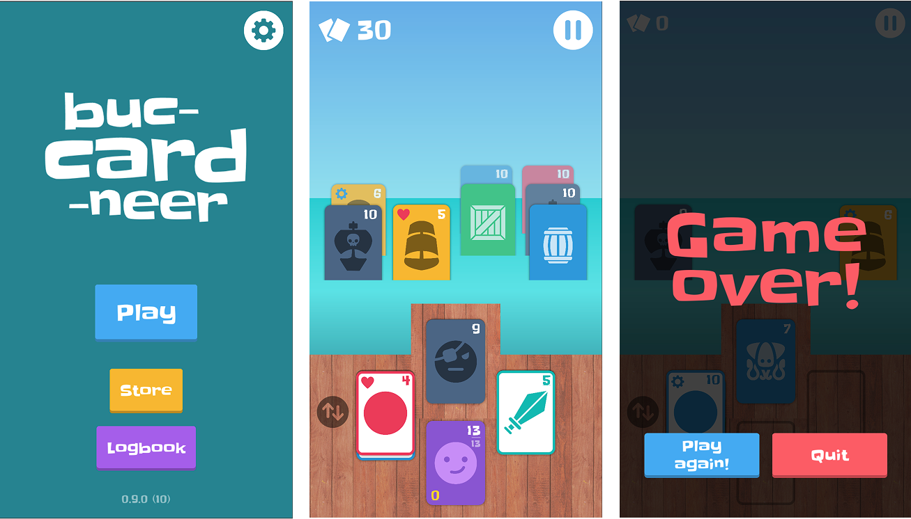

# Buc-card-neer

A prototype of a card game with a buccaneering theme, built on Unity.

The game was implemented using [UniRx (Unity's Reactive eXtensions)](https://github.com/neuecc/UniRx) extensively. The goal (as a means of experiment) was to implement the game as an app, by composing models (and view-models) comprised of reactive properties and observable streams to subscribe to for specific events. To this end, the game also incorporates the [MVVM architecture](https://en.wikipedia.org/wiki/Model%E2%80%93view%E2%80%93viewmodel) to support the dense UI-oriented content of the game.

Furthermore, the game uses [Zenject](https://github.com/modesttree/Zenject) for dependency injection and to manage the binding of its entities.

Requires **Unity 6.4 (6000.4.5f1)**.

## Credits

### Fonts

- [Slackey by Sideshow from Google Fonts](https://fonts.google.com/specimen/Slackey)

### Audio

- [RPG Audio from Kenney](https://kenney.nl/assets/rpg-audio)
- [Music Jingles from Kenney](https://kenney.nl/assets/music-jingles)
- Sound Effect by [DRAGON-STUDIO](https://pixabay.com/users/dragon-studio-38165424/?utm_source=link-attribution&utm_medium=referral&utm_campaign=music&utm_content=390285) from [Pixabay](https://pixabay.com/sound-effects//?utm_source=link-attribution&utm_medium=referral&utm_campaign=music&utm_content=390285)
- Sound Effect by [DRAGON-STUDIO](https://pixabay.com/users/dragon-studio-38165424/?utm_source=link-attribution&utm_medium=referral&utm_campaign=music&utm_content=393839) from [Pixabay](https://pixabay.com/sound-effects//?utm_source=link-attribution&utm_medium=referral&utm_campaign=music&utm_content=393839)
- Sound Effect by [Universfield](https://pixabay.com/users/universfield-28281460/?utm_source=link-attribution&utm_medium=referral&utm_campaign=music&utm_content=352459) from [Pixabay](https://pixabay.com//?utm_source=link-attribution&utm_medium=referral&utm_campaign=music&utm_content=352459)
